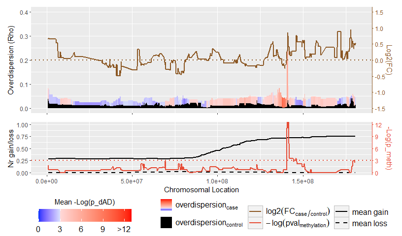

<!-- README.md is generated from README.Rmd. Please edit that file -->

# MAGE

<!-- badges: start -->
<!-- badges: end -->

Welcome to MAGE’s readme!

MAGE is the Modeller of Allelic Gene Expression, an R package providing
extensive functions for various RNAseq-based allelic analyses. This
ranges from basic tasks such as (solely) RNAseq-base genotyping, to the
analysis of more complex population-level phenomena such as
(differential) allelic bias, allellic divergence and (loss of)
imprinting analyses. More information about what these are and how to
model them using MAGE can be found in the package vignette.

## Installation

MAGE can be installed using the function from the package:

``` r
library(devtools)
install_github("BioBix/MAGE")
```

## Getting started

Link to vignette and website…

MAGE does stuff:

``` r
library(MAGE)
data("MAGE", package = "MAGE")

ChromPlot <- MAGE::MAGE_ADChromplot(AD_Data, DE_Data, Meth_Data, CNAgain_Data, CNAloss_Data,
                                    pvalSIG = 0.05, roll_median = 15)

ChromPlot[["ADDE_plot"]] / ChromPlot[["MethCNA_plot"]] / (ChromPlot[["LEG1"]] + 
  ChromPlot[["LEG2"]] + ChromPlot[["LEG3"]]) + 
  patchwork::plot_layout(heights = c(2,1,0.5), widths = c(1,1,1))
```


